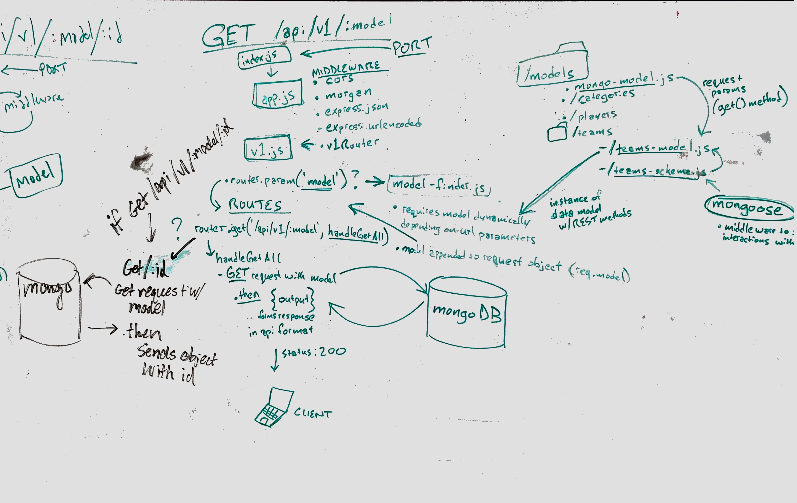
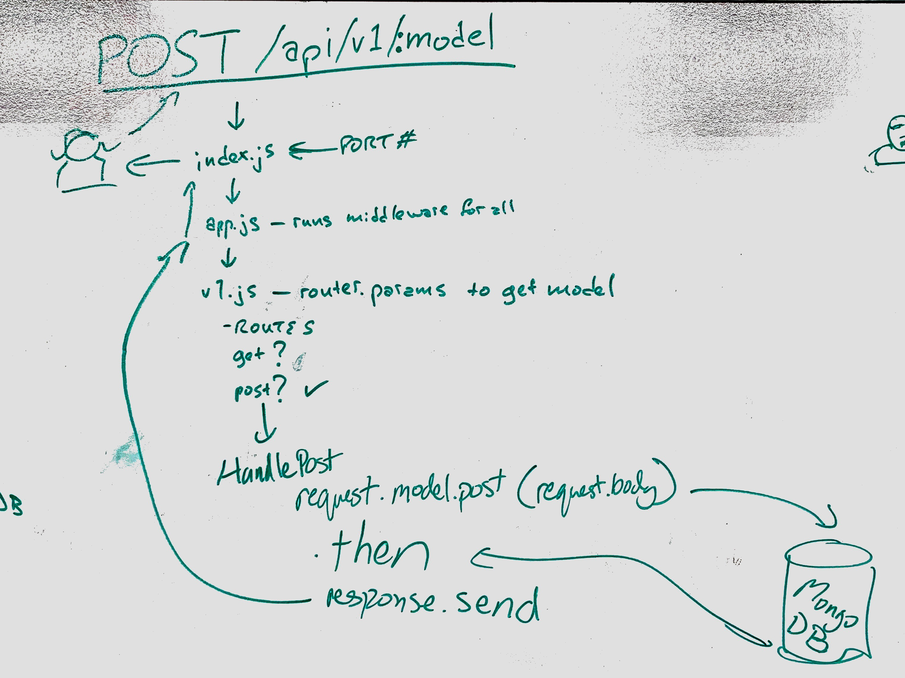
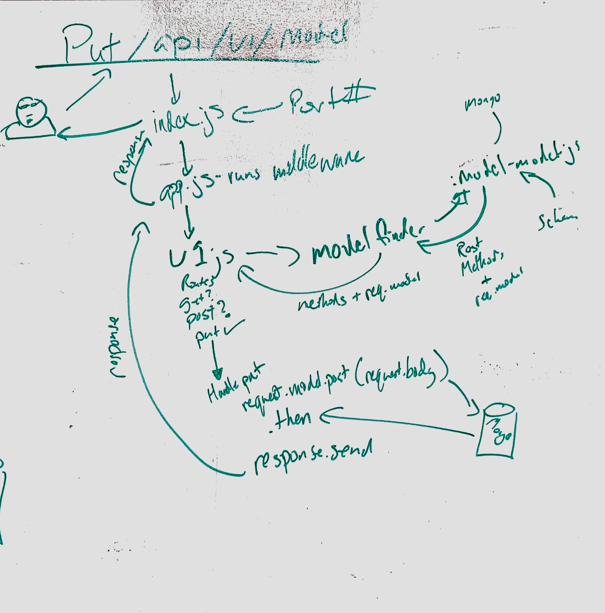
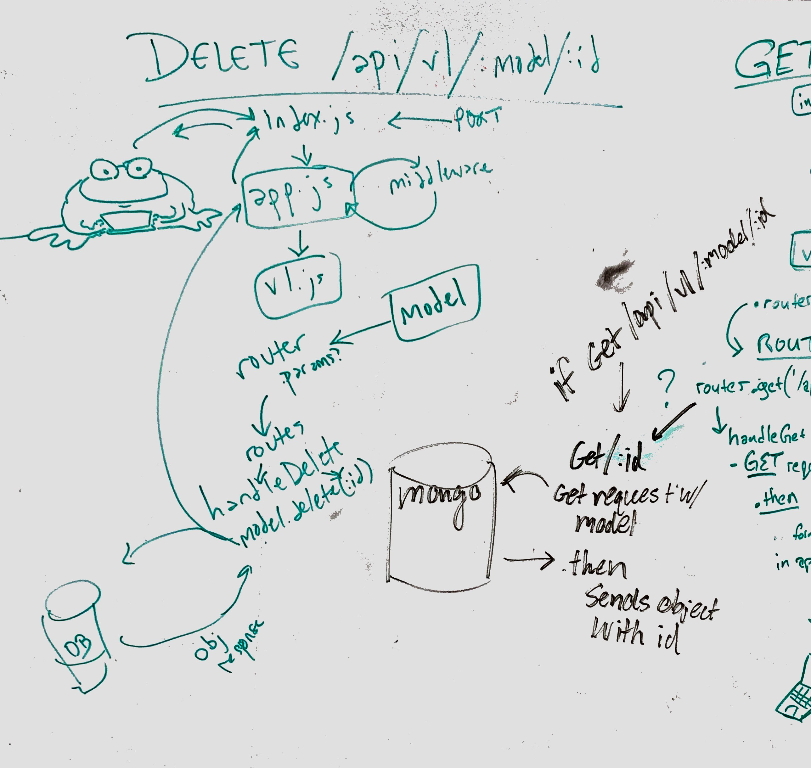

 LAB
=================================================

## Lab 09: API Server

### Author: Joseph Wolfe

### Links and Resources
* [PR](https://github.com/charmedsatyr-401-advanced-javascript/lab-09/pull/1)
* 
* [front end](https://hidden-escarpment-25308.herokuapp.com)

#### Documentation
* [jsdoc](https://hidden-escarpment-25308.herokuapp.com/docs/index.html)
* [swagger](https://hidden-escarpment-25308.herokuapp.com/api/v1/doc/)

### Modules
`./index.js`

`.src/app.js`

`.src/api/v1.js`

`./src/models/mongo-model.js`
`./src/models/memory-model.js`

`./src/models/categories/categories-model.js`

`./src/models/players/players-model.js`
`./src/models/players/players-schema.js`

`./src/models/teams-model.js`
`./src/models/teams-schema.js`

#### `./index.js`
##### Exported Values and Methods from `./index.js`
This is the entry point of the application.

#### `.src/app.js`
##### Exported Values and Methods from `./src/app.js`
This module exports the application's Express `app` module and `start` method.

#### `.src/api/v1.js`
##### Exported Values and Methods from `v1.js`
This module exports an Express `router` that supports the following endpoints and associated content:

* `/` and `/api/v1/doc`, Swagger live API documentation

* `/docs`, JSDocs documentation

The models `categories`, `teams`, and `players` are dynamically supported parameters for the following, where `id` parameters are generated by the database:

* `/api/v1/:model`, supports `GET` and `POST` requests

* `/api/v1/:model/:id`, supports `GET`, `PUT`, and `DELETE` requests

#### `src/models/mongo-model.js`
##### Exported Values and Methods from `mongo-model.js`
`get()` -> `Promise` -> `Array of objects` from database

`get(_id)` -> `Promise` -> `object` from database

`post(record)` -> `Promise` -> new `record` from database

`put(_id, record)` -> `Promise` -> modified `record` from database

`delete(_id)` -> `Promise` -> deleted `record` from database

#### `src/models/memory-model.js`
##### Exported Values and Methods from `memory-model.js`
`sanitize(entry)` -> returns a validated record or `undefined`

`count` -> returns the length of the database

`get()` -> `Promise` -> `Array of objects` from database

`get(id)` -> `Promise` -> `object` from database

`post(record)` -> `Promise` -> new `record` from database

`put(id, record)` -> `Promise` -> modified `record` from database

`delete(id)` -> `Promise` -> deleted `record` from database

#### `src/models/categories/`
##### Exported Values and Methods from `categories-model.js`
Exports an instance of a `Categories` model, which extends the exported class from `.src/models/memory-model.js` instantiated with a private schema.

#### `src/models/players/`
##### Exported Values and Methods from `players-model.js`
Exports an instance of a `Players` model, which extends the exported class from `.src/models/mongo-model.js` instantiated with the Mongoose schema from `players-schema.js`.

##### Exported Values and Methods from `players-schema.js`
Exports a Mongoose schema, `players`.

#### `src/models/teams/`
##### Exported Values and Methods from `teams-model.js`
Exports an instance of a `Teams` model, which extends the exported class from `.src/models/mongo-model.js` instantiated with the Mongoose schema from `teams-schema.js`.

##### Exported Values and Methods from `teams-schema.js`
Exports a Mongoose schema, `teams`

#### Running the app
* Start the server on your local machine with `npm run start` or `node index.js`.

* See the `front end` link above for live API documentation.

Example API requests using the `httpie` package on the command line:
  * `GET` to the `teams` endpoint:

`http https://hidden-escarpment-25308.herokuapp.com/api/v1/teams`

  * `POST` to the `players` endpoint:

`echo '{"name":"Tom", "position": "P", "throws":"L", "bats":"R", "team":"JavaScript"}' | http post https://hidden-escarpment-25308.herokuapp.com/api/v1/players`

  * `PUT` to the `players` endpoint (modifying the `Tom` record):

`echo '{"name":"Tom", "position": "1B", "throws":"R", "bats":"L", "team":"Mariners"}' | http put https://hidden-escarpment-25308.herokuapp.com/api/v1/players/5c9e31fbd167e7000498d013`

  * `DELETE` to the `players` endpoint (deleting the `Tom` record):

`http delete https://hidden-escarpment-25308.herokuapp.com/api/v1/players/5c9e31fbd167e7000498d013`

#### Tests
* How do you run tests?
  * `npm run test`
  * `npm run test-watch`
  * `npm run lint`

* What assertions were made?
  * `players-models.js`
    * can post() a new player
    * can get() a player

* What assertions need to be / should be made?
  * All REST methods for the models `teams`, `players`, and `categories` should be tested.
  * End-to-end testing should be performed on the server and routes.

#### UML
`GET` requests

`POST` requests

`PUT` requests

`DELETE` requests

